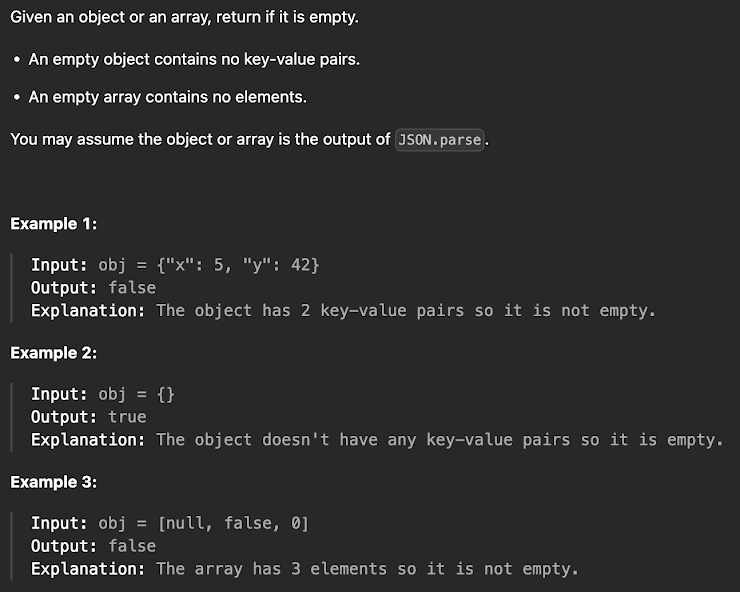

# Задания

1. Реализовать одну из функция массива на выбор (map, filter, reduce) и заменить ею уже существующую функцию в Array

2. Реализовать логику для получения данных и отобразите список (при знании React, пишите реализацию на React) 
Данные расположены в сети интернет и доступны тут: https://jsonplaceholder.typicode.com/todos

3. Реализуйте функцию для вывода всех ключей объекта, включая ключи его прототипа

4. Решите задачу

5. Реализовать цикл for of для объекта, который будет на каждой итерации получать ключ и значение